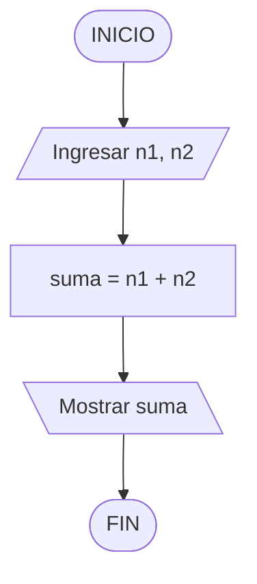
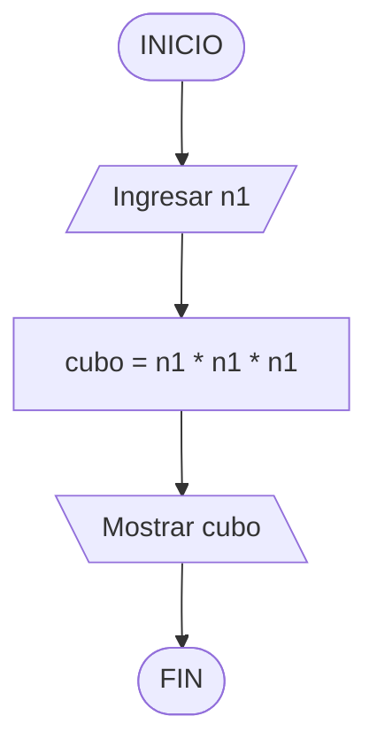
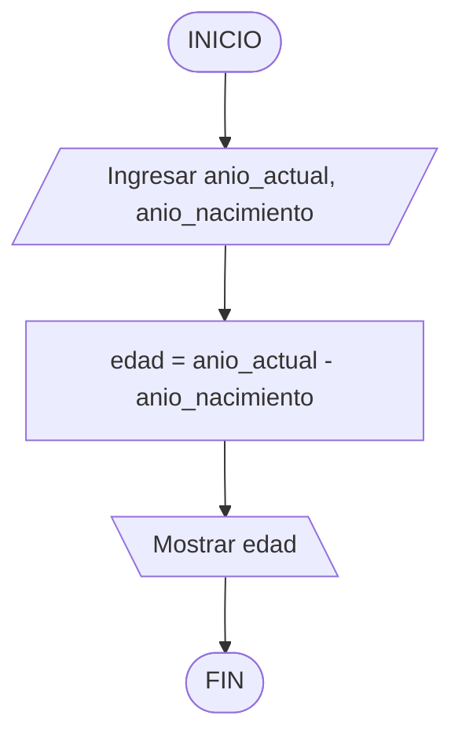
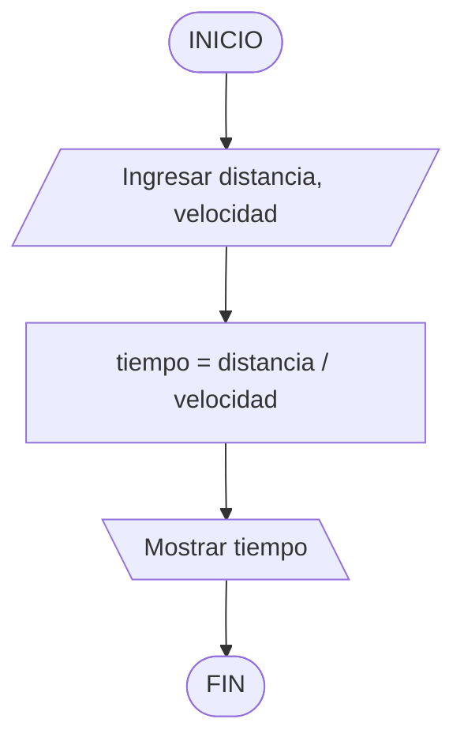
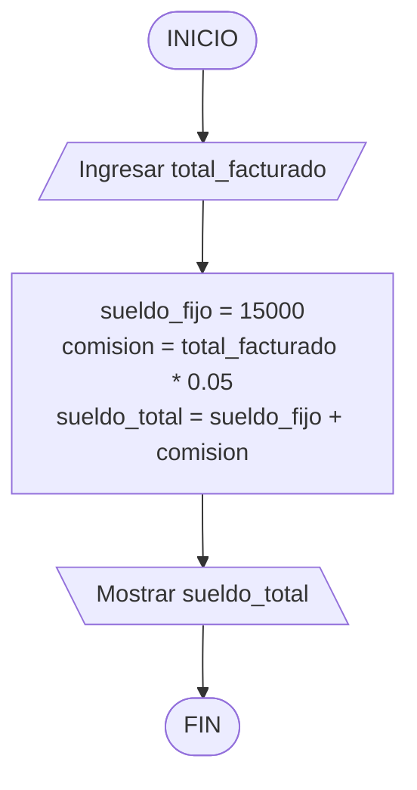
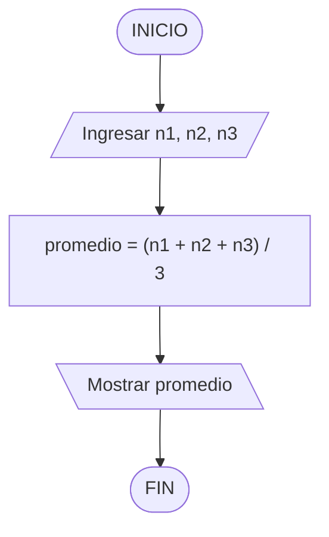
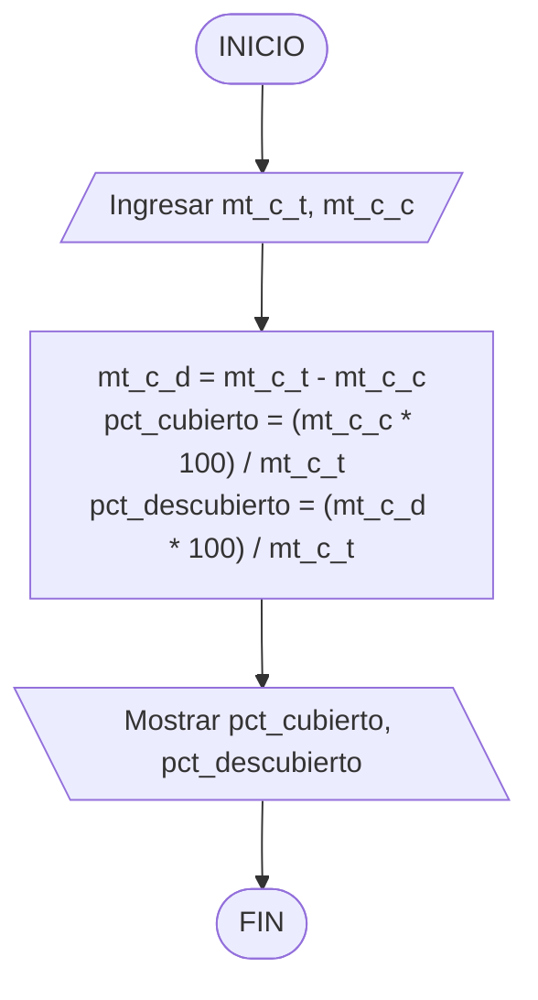

# 🏋️‍♂️ Ejercicios Resueltos - Bloque 2: Secuenciales

---

## 1. Suma de dos números

*Consigna:* Hacer un programa para solicitar dos números enteros por teclado y luego emitir por pantalla el resultado de la suma de ambos.



```python
n1 = int(input("Ingrese el primer número: "))
n2 = int(input("Ingrese el segundo número: "))

suma = n1 + n2

print("El resultado de la suma es:", suma)

```

---

## 2. Elevar al cubo

*Consigna:* Hacer un programa para solicitar por teclado un número y luego devolver su valor elevado al cubo.

*Nota: no olvides que sólo contamos con las cuatro operaciones básicas.*



```python
n1 = int(input("Ingrese su número: "))
cubo = n1 * n1 * n1

print("Su número elevado al cubo es:", cubo)

```

---

## 3. Calcular edad

*Consigna:* Hacer un programa que permita ingresar el año actual y el año de la fecha de nacimiento de una persona y luego calcule y emita por pantalla su edad.

*Nota: no hay que tener en cuenta si la persona cumplió años o no, simplemente calcular.*



```python
anio_actual = int(input("Ingrese el año actual: "))
anio_nacimiento = int(input("Ingrese su año de nacimiento: "))

edad = anio_actual - anio_nacimiento

print("Su edad aproximada es de:", edad, "años.")

```

---

## 4. Tiempo estimado de viaje

*Consigna:* Hacer un programa que permita ingresar los kilómetros existentes entre dos ciudades y la velocidad promedio de un vehículo. Calcular y emitir por pantalla el tiempo aproximado que demandará llegar de un punto a otro teniendo en cuenta los datos ingresados.



```python
distancia = float(input("Ingrese los kilómetros entre ambas ciudades: "))
velocidad = float(input("Ingrese la velocidad promedio (km/h): "))

tiempo = distancia / velocidad

print(f"El tiempo estimado de viaje es de: {tiempo} hs")

```

---

## 5. Sueldo total con comisión

*Consigna:* Una casa de computación paga a sus empleados un sueldo fijo de ARS 15000 más una comisión del 5% sobre el total facturado por cada empleado. Hacer un programa para ingresar el total facturado por un empleado y que luego calcule y emita por pantalla el sueldo total a cobrar por el mismo.



```python
total_facturado = float(input("Ingrese el total facturado por el empleado: "))

sueldo_fijo = 15000
comision = total_facturado * 0.05
sueldo_total = sueldo_fijo + comision

print(f"El sueldo total a cobrar es: ${sueldo_total}")


```

---

## 6. Promedio de tres notas

*Consigna:* Hacer un programa para ingresar por teclado las tres notas de exámenes de un alumno y luego calcule y emita por pantalla el promedio final.



```python
n1 = float(input("Ingrese su primera nota: "))
n2 = float(input("Ingrese su segunda nota: "))
n3 = float(input("Ingrese su tercera nota: "))

promedio = (n1 + n2 + n3) / 3

print(f"Su promedio final es: {promedio}")

```

---

En la parte inferior de tu pantalla de Visual Studio Code (en el bloque de tres comillas donde cierra el código Python) tenés este error de sintaxis:

```markdown
```python
...
print(f"El porcentaje...")


---

## 7. Porcentaje de metros cubiertos y descubiertos

*Consigna:* Hacer un programa para ingresar por teclado los metros cuadrados totales de un predio y los metros cuadrados cubiertos; luego calcular y mostrar por pantalla el porcentaje de metros cuadrados cubiertos y el porcentaje de metros cuadrados descubiertos.



```python
mt_c_t = int(input("Ingrese la cantidad de metros cuadrados totales: "))
mt_c_c = int(input("Ingrese la cantidad de metros cuadrados cubiertos: "))

mt_c_d = mt_c_t - mt_c_c

pct_cubierto = (mt_c_c * 100) / mt_c_t
pct_descubierto = (mt_c_d * 100) / mt_c_t

print(f"El porcentaje de metros cuadrados cubiertos es {pct_cubierto:.2f}% y el porcentaje de descubierto es {pct_descubierto:.2f}%")

```

---
