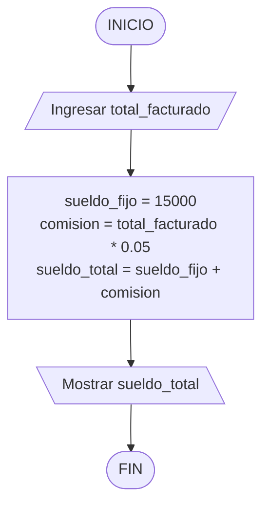

```mermaid
graph TD
    A([INICIO]) --> B[/Ingresar total_facturado/]
    B --> C[sueldo_fijo = 15000<br>comision = total_facturado * 0.05<br>sueldo_total = sueldo_fijo + comision]
    C --> D[\Mostrar sueldo_total\]
    D --> E([FIN])
```