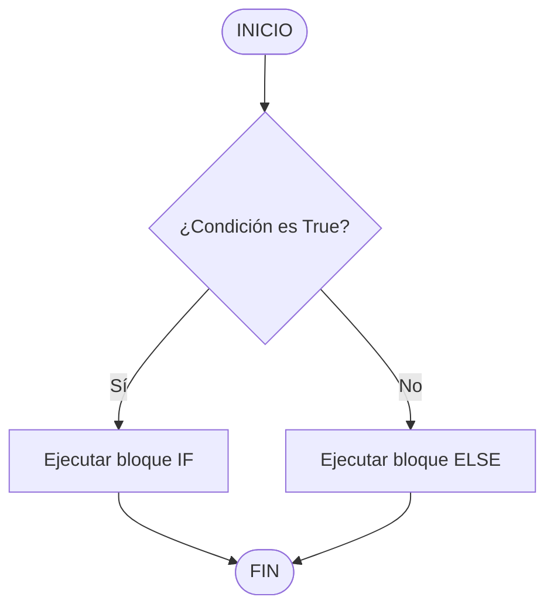
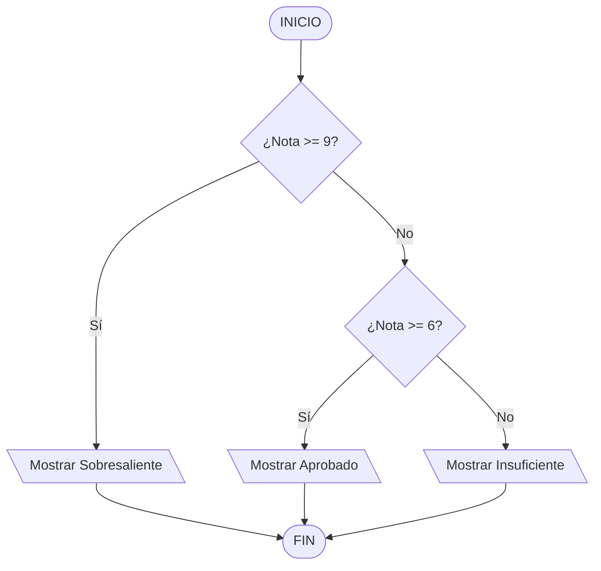

# 3. Estructuras Condicionales

En este módulo aprenderemos a controlar el flujo de ejecución de nuestros programas mediante la **toma de decisiones**. Un programa ya no se ejecutará únicamente de forma lineal de arriba hacia abajo, sino que podrá tomar caminos diferentes según se cumplan o no determinadas condiciones.

---

## 📌 ¿Qué es una Estructura Condicional?

En la vida real tomamos decisiones constantemente: *Si llueve, llevo paraguas; si no, voy en bicicleta*. 

En programación, una **condición** es una expresión lógica que solo puede devolver uno de dos valores: **Verdadero (`True`)** o **Falso (`False`)**. Según este resultado, el programa elegirá ejecutar un bloque de código u otro.

---

## 🚦 1. Estructura Selectiva Simple (`if`)

Permite ejecutar un bloque de código **únicamente si la condición es verdadera**. Si es falsa, el programa ignora el bloque y continúa.

### Sintaxis en Python:
```python
if condicion:
    # Código a ejecutar si la condición es True

```

> ⚠️ **Importante:** En Python, el bloque dentro del `if` debe estar **indentado** (con una sangría de 4 espacios o un Tabulador) debajo de los dos puntos `:`.

### Ejemplo:

```python
edad = int(input("Ingrese su edad: "))

if edad >= 18:
    print("Sos mayor de edad.")

```

---

## 🔀 2. Estructura Selectiva Doble (`if - else`)

Permite evaluar dos alternativas: un camino si la condición es verdadera y otro distinto si es falsa.



### Sintaxis en Python:

```python
if condicion:
    # Bloque si es True
else:
    # Bloque si es False

```

### Ejemplo:

```python
nota = float(input("Ingrese la nota del examen: "))

if nota >= 6:
    print("Aprobado")
else:
    print("Desaprobado")

```

---

## 🔀🔀 3. Estructuras Anidadas y Múltiples (`if - elif - else`)

Cuando tenemos **más de dos posibilidades**, podemos encadenar condiciones usando `elif` (abreviación de *else if*).



### Ejemplo:

```python
nota = float(input("Ingrese la nota: "))

if nota >= 9:
    print("Sobresaliente")
elif nota >= 6:
    print("Aprobado")
else:
    print("Insuficiente")

```

---

## 🔗 4. Operadores Lógicos (`and`, `or`, `not`)

Nos permiten combinar múltiples condiciones dentro de una misma evaluación.

| Operador | Descripción | Ejemplo | Resultado |
| --- | --- | --- | --- |
| **`and`** | Devuelve `True` **solo si ambas** condiciones son verdaderas. | `(edad >= 18) and (tiene_registro == True)` | Requiere ambas cumplidas |
| **`or`** | Devuelve `True` si **al menos una** condición es verdadera. | `(es_fin_de_semana) or (es_feriado)` | Basta con que una se cumpla |
| **`not`** | Invierte el valor lógico (lo Verdadero lo hace Falso y viceversa). | `not (edad < 18)` | Evalúa si NO es menor de 18 |

### Ejemplo con `and` y `or`:

```python
edad = int(input("Ingrese su edad: "))
tiene_carnet = True

if edad >= 18 and tiene_carnet:
    print("Puede manejar el vehículo.")
else:
    print("No está habilitado para manejar.")

```

---

## 🎛️ 5. Selección Múltiple (`match case`)

Equivalente al `switch` en otros lenguajes. Es ideal cuando debemos evaluar el valor exacto de una variable contra múltiples casos posibles.

```python
opcion = int(input("Elija una opción (1-3): "))

match opcion:
    case 1:
        print("Cargando saldo...")
    case 2:
        print("Consultando movimientos...")
    case 3:
        print("Saliendo del sistema...")
    case _:
        print("Opción inválida")  # El '_' actúa como el else por defecto

```

---

## 🔢 6. Acumuladores y Contadores

Son variables auxiliares fundamentales al trabajar con estructuras condicionales y repetitivas.

### 🧮 Contador

Una variable que se incrementa o decrementa en un **valor constante** (usualmente de 1 en 1). Se utiliza para contar eventos.

```python
contador_aprobados = 0

if nota >= 6:
    contador_aprobados = contador_aprobados + 1  # O de forma simplificada: contador_aprobados += 1

```

### 💰 Acumulador

Una variable que suma o acumula **valores variables**. Se utiliza para calcular totales.

```python
suma_monto_total = 0

if compra_valida:
    suma_monto_total = suma_monto_total + precio_producto  # O de forma simplificada: suma_monto_total += precio_producto

```

---

## 💡 Buenas Prácticas y Errores Comunes

1. **Confundir `=` con `==`:**
* `=` es para **asignar** un valor a una variable: `edad = 20`.
* `==` es para **comparar** si dos valores son iguales: `if edad == 20:`.


2. **Olvidar los dos puntos `:`:** Cada instrucción `if`, `elif`, `else` o `case` debe finalizar obligatoriamente con `:`.
3. **Mala indentación:** Todo el bloque de código dependiente de la condición debe mantener el mismo nivel de sangría hacia la derecha.

```
